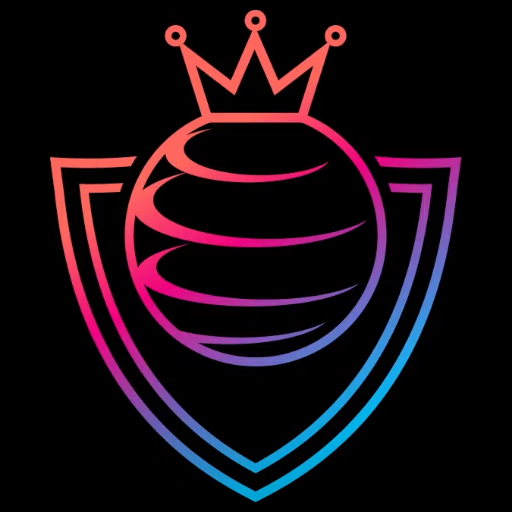

# Chaos League

> [!NOTE]
> This README.md is a **Work in Progress**.  
> You will find places containing `TODO`s. This means that this part is not yet completed and may get updated in a future commit.

This is the source of the Chaos League Game.  
Chaos League is a Streaming-based Multiplayer Game created by the YouTuber [DoodleChaos].

## Structure

The project is split up into 3 folders:

- `Assets` which contains assets such as plugins, extensions and more.
- `Packages` containing the `manifest.json` and `packages-lock.json` files.
- `ProjectSettings` containing configuration (JSON) files and asset files.

## Contribute

Please read the CONTRIBUTING.md file (TODO) for how you can contribute to this project and what is important.

## Streaming Chaos League

To Stream Chaos League yourself, you need to meet certain prerequisites and also have to build the game yourself.

### Prerequisites

- Windows operating system. Linux Distros and Mac are currently **not** supported.
- Twitch affiliate status. The game requires channel points which are only available for affiliates on Twitch.

### Building the game

TODO: Add instructions for building the game.

## License

This project is available under the [GNU General Public License v3.0](./LICENSE).

[DoodleChaos]: https://www.youtube.com/@DoodleChaos
